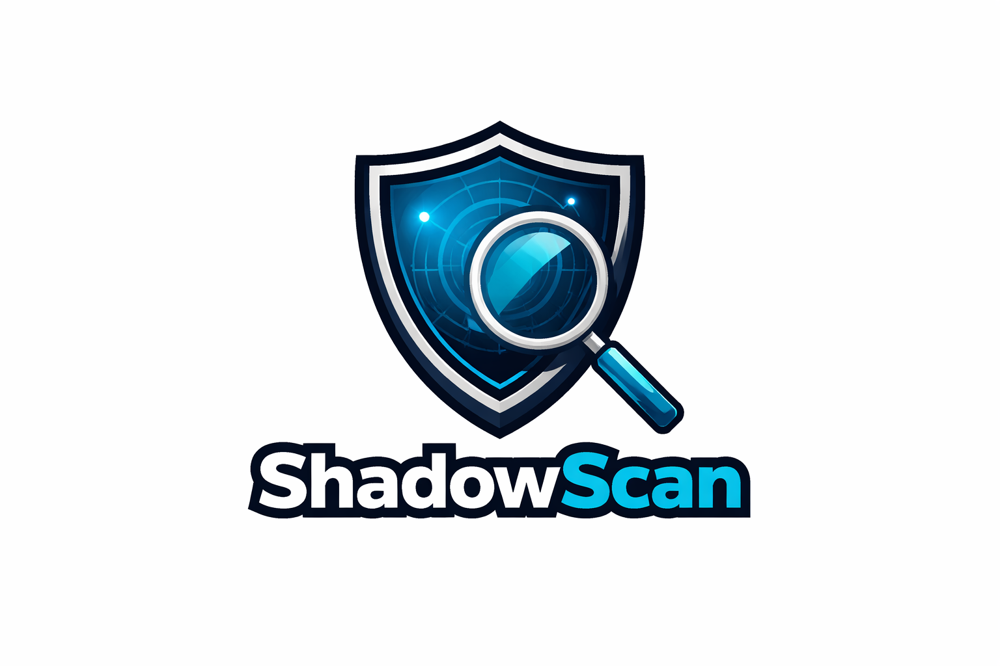

<p align="center">
  
  
  
  
</p>

<h1 align="center">
  
  <br>
  🔍 ShadowScan - Advanced Network Port Scanner
</h1>

<p align="center">
  <i>A professional penetration testing tool for network reconnaissance and port scanning</i>
  <br>
  <b>🇫🇷 Navigation France | Multilingual Support</b>
</p>

---

## 📋 Table of Contents

- [📖 About ShadowScan](#-about-shadowscan)
- [✨ Features](#-features)
- [🚀 Installation](#-installation)
- [💻 Usage](#-usage)
- [🔧 Command Line Options](#-command-line-options)
- [📊 Scan Types](#-scan-types)
- [🎨 Output Examples](#-output-examples)
- [📁 Project Structure](#-project-structure)
- [🛡️ Security Considerations](#️-security-considerations)
- [🤝 Contributing](#-contributing)
- [📜 License](#-license)
- [👤 Author](#-author)
- [⭐ Star History](#-star-history)

---

## 📖 About ShadowScan

**ShadowScan** is an advanced, feature-rich network port scanner designed for penetration testers, cybersecurity professionals, and network administrators. Built with Python, it provides comprehensive network reconnaissance capabilities with an intuitive interface featuring **French navigation support** (Navigation France).

ShadowScan enables security professionals to discover open ports, identify running services, grab banners, and assess network exposure efficiently. The tool employs multi-threading for high-performance scanning and provides detailed, color-coded output for easy interpretation of results.

### 🎯 Key Highlights

| Feature | Description |
|---------|-------------|
| **TCP Connect Scan** | Standard full TCP handshake scanning |
| **SYN Scan (Stealth)** | Half-open TCP scan for stealthy reconnaissance |
| **UDP Scan** | Comprehensive UDP port scanning with service detection |
| **OS Fingerprinting** | Remote operating system detection via TCP/IP stack analysis |
| **Banner Fingerprinting** | Service identification with 100+ signatures |
| **Modular Architecture** | Extensible, maintainable code structure |
| **Multi-threaded** | Optimized thread pool for high-performance scanning |
| **French Navigation** | Intuitive menu system with French language support |

---

## ✨ Features

### 🔍 Core Scanning Capabilities

- **TCP Connect Scan**: Full TCP handshake - most reliable, easily detected
- **SYN Scan (Stealth)**: Half-open scan - faster, requires root privileges
- **UDP Scan**: Connectionless scanning for UDP services (DNS, SNMP, etc.)
- **Custom Port Ranges**: Scan specific ports or ranges
- **Service Detection**: Identify 50+ services automatically
- **Banner Grabbing**: Protocol-specific probes for accurate fingerprinting

### 🔬 Advanced Features

- **OS Fingerprinting**: Detect remote OS via TTL analysis, ICMP probing, and port patterns
- **Banner Analysis**: Comprehensive database with 100+ service signatures
- **Vulnerability Hints**: Known CVE patterns for detected services
- **CPE Generation**: Common Platform Enumeration for vulnerability databases

### 🎨 User Interface

- **Interactive Mode**: Menu-driven interface with French navigation
- **Command Line Mode**: Full-featured CLI for automation and scripting
- **Color-coded Results**: Visual distinction by port type and security level
- **Multiple Export Formats**: JSON and TXT output

### ⚡ Performance Features

- **Optimized Thread Pool**: Dynamic worker adjustment based on task count
- **Rate Limiting**: Control scan speed to avoid detection
- **Batch Processing**: Efficient handling of large port ranges
- **Graceful Interruption**: Clean Ctrl+C handling with partial results

---

## 🚀 Installation

### Prerequisites

- Python 3.8 or higher
- pip (Python package manager)
- Git (optional, for cloning)

---

### Step 1: Clone the Repository

```bash
# Clone the repository
git clone https://github.com/meherazhosensiam/ShadowScan.git

# Navigate to the directory
cd ShadowScan
```

---

### Step 2: Create Virtual Environment

**Virtual environment is highly recommended** to keep dependencies isolated and avoid conflicts with other Python projects.

#### On Linux / macOS:

```bash
# Create virtual environment
python3 -m venv venv

# Activate virtual environment
source venv/bin/activate
```

#### On Windows:

```bash
# Create virtual environment
python -m venv venv

# Activate virtual environment
venv\Scripts\activate
```

#### On Windows (PowerShell):

```powershell
# Create virtual environment
python -m venv venv

# Activate virtual environment
.\venv\Scripts\Activate.ps1
```

> **Note**: After activation, you will see `(venv)` prefix in your terminal prompt, indicating the virtual environment is active.

---

### Step 3: Install Dependencies

```bash
# Install required packages
pip install -r requirements.txt
```

Or install manually:

```bash
# Install colorama for colored output (recommended)
pip install colorama
```

---

### Step 4: Make Script Executable (Linux/macOS)

```bash
# Make the script executable
chmod +x shadowscan.py
```

---

### Step 5: Verify Installation

```bash
# Run ShadowScan with version flag
python shadowscan.py --version

# Or run interactive mode
python shadowscan.py -i
```

---

### Deactivate Virtual Environment

When you're done using ShadowScan, you can deactivate the virtual environment:

```bash
# Deactivate virtual environment
deactivate
```

---

## 💻 Usage

### Interactive Mode (Recommended for Beginners)

```bash
# Make sure virtual environment is activated first
python shadowscan.py -i
```

This launches the interactive menu with French navigation:

```
╔═══════════════════════════════════════════════════════════════════╗
║  🇫🇷 Bienvenue dans ShadowScan - Navigation France              ║
╠═══════════════════════════════════════════════════════════════════╣
║  [1] TCP Quick Scan    [2] TCP Full Scan    [3] SYN Scan        ║
║  [4] UDP Scan          [5] Custom Ports     [6] Banner Grab     ║
║  [7] OS Fingerprint    [8] Export Results   [9] About           ║
║  [0] Exit                                                         ║
╚═══════════════════════════════════════════════════════════════════╝
```

### Command Line Examples

#### TCP Quick Scan (Common Ports)
```bash
python shadowscan.py -t 192.168.1.1
```

#### TCP Full Port Scan
```bash
python shadowscan.py -t example.com --tcp --full
```

#### SYN Scan (Stealth - Requires Root)
```bash
sudo python shadowscan.py -t 192.168.1.1 --syn
```

#### UDP Scan
```bash
python shadowscan.py -t 192.168.1.1 --udp
```

#### Custom Port Range
```bash
python shadowscan.py -t 10.0.0.1 -p 1-1000
```

#### Specific Ports
```bash
python shadowscan.py -t 192.168.1.1 -p 22,80,443,8080
```

#### Banner Grabbing Enabled
```bash
python shadowscan.py -t 192.168.1.1 -b -v
```

#### OS Fingerprinting
```bash
python shadowscan.py -t 192.168.1.1 --os-fingerprint
```

#### Export Results
```bash
python shadowscan.py -t 192.168.1.1 -e results.json
```

---

## 🔧 Command Line Options

| Option | Long Form | Description |
|--------|-----------|-------------|
| `-t` | `--target` | Target IP address or hostname |
| `-p` | `--ports` | Port range (e.g., 1-1000) or comma-separated list |
| `--tcp` | | TCP connect scan (default) |
| `--syn` | | SYN scan (requires root privileges) |
| `--udp` | | UDP scan |
| `--full` | | Perform full port scan (1-65535) |
| `--quick` | | Quick scan on common ports (default) |
| `-b` | `--banner` | Enable banner grabbing |
| `--os-fingerprint` | | Enable OS fingerprinting |
| `-th` | `--threads` | Number of threads (default: 100) |
| `-to` | `--timeout` | Connection timeout in seconds (default: 1.0) |
| `-v` | `--verbose` | Enable verbose output |
| `-e` | `--export` | Export results to file |
| `-i` | `--interactive` | Run in interactive mode |
| | `--version` | Show version information |

---

## 📊 Scan Types

### 1. TCP Connect Scan
Standard full TCP handshake scanning. Most reliable but easily detected.
- Completes full 3-way handshake
- Works without special privileges
- Most accurate results

### 2. SYN Scan (Stealth)
Half-open TCP scan for stealthy reconnaissance.
- Sends SYN, analyzes response, no ACK
- Faster than TCP connect
- **Requires root/admin privileges**
- Harder to detect

### 3. UDP Scan
Connectionless scanning for UDP services.
- DNS (53), SNMP (161), TFTP (69), NTP (123)
- DHCP, mDNS, and more
- Uses protocol-specific probes
- Slower due to timeout requirements

### 4. OS Fingerprinting
Remote operating system detection through TCP/IP stack analysis.
- TTL analysis for OS family detection
- ICMP probing for additional fingerprinting
- Port pattern analysis for OS classification
- Estimated hop distance calculation

---

## 🎨 Output Examples

### Standard Output

```
════════════════════════════════════════════════════════════════════
   ███████╗ ██████╗ ██████╗ ███████╗███╗   ██╗ ██████╗ ███████╗
   ██╔════╝██╔═══██╗██╔══██╗██╔════╝████╗  ██║██╔════╝ ██╔════╝
   ███████╗██║   ██║██║  ██║█████╗  ██╔██╗ ██║██║  ███╗█████╗  
   ╚════██║██║   ██║██║  ██║██╔══╝  ██║╚██╗██║██║   ██║██╔══╝  
   ███████║╚██████╔╝██████╔╝███████╗██║ ╚████║╚██████╔╝███████╗
   ╚══════╝ ╚═════╝ ╚═════╝ ╚══════╝╚═╝  ╚═══╝ ╚═════╝ ╚══════╝
════════════════════════════════════════════════════════════════════

[*] Starting ShadowScan against: 192.168.1.1 (192.168.1.1)
[*] Scan started at: 2024-01-15 14:30:00
[*] Scanning 24 ports with 100 threads
────────────────────────────────────────────────────────────────────

[+] Port    22/tcp  OPEN    SSH (Secure Shell)
[+] Port    80/tcp  OPEN    HTTP (HyperText Transfer Protocol)
[+] Port   443/tcp  OPEN    HTTPS (HTTP Secure)
[+] Port  3306/tcp  OPEN    MySQL

────────────────────────────────────────────────────────────────────
[✓] Scan Complete!
[*] Target: 192.168.1.1
[*] Open Ports: 4
[*] Scan Duration: 0.52 seconds
[*] Finished: 2024-01-15 14:30:01
════════════════════════════════════════════════════════════════════
```

### JSON Export Format

```json
{
    "tool": "ShadowScan",
    "version": "2.0.0",
    "author": "Meheraz HOSEN SIAM",
    "target": "192.168.1.1",
    "scan_date": "2024-01-15 14:30:00",
    "duration": "0:00:00.520000",
    "total_open_ports": 4,
    "open_ports": [
        {
            "port": 22,
            "state": "open",
            "service": "SSH (Secure Shell)",
            "banner": "SSH-2.0-OpenSSH_8.9"
        },
        {
            "port": 80,
            "state": "open",
            "service": "HTTP (HyperText Transfer Protocol)",
            "banner": null
        }
    ]
}
```

---

## 📁 Project Structure

```
ShadowScan/
├── shadowscan.py              # Main entry point
├── shadowscan-logo.png        # Logo image
├── README.md                  # Documentation
├── requirements.txt           # Python dependencies
├── LICENSE                    # Shadow Public License v1.0
├── setup.py                   # Pip installation config
│
└── shadowscan/                # Modular package
    ├── __init__.py
    ├── __main__.py            # CLI entry point
    │
    ├── core/                  # Core modules
    │   ├── __init__.py
    │   ├── scanner.py         # Base scanner class
    │   └── thread_pool.py     # Optimized threading
    │
    ├── scanners/              # Scanner implementations
    │   ├── __init__.py
    │   ├── tcp_scan.py        # TCP connect scanner
    │   ├── syn_scan.py        # SYN stealth scanner
    │   └── udp_scan.py        # UDP scanner
    │
    ├── fingerprint/           # Fingerprinting modules
    │   ├── __init__.py
    │   ├── os_detect.py       # OS fingerprinting
    │   └── banner_db.py       # Banner database
    │
    └── utils/                 # Utilities
        ├── __init__.py
        ├── network.py         # Network utilities
        └── output.py          # Output formatting
```

---

## 🛡️ Security Considerations

### ⚠️ Important Notice

**ShadowScan is designed for authorized security testing only.** Before using this tool, ensure you have:

1. **Explicit Permission**: Written authorization from the system owner
2. **Legal Compliance**: Understanding of local and international laws
3. **Professional Responsibility**: Use for defensive security purposes only

### Legal Disclaimer

The author, **Meheraz HOSEN SIAM**, is not responsible for any misuse or damage caused by this tool. This software is provided for educational and authorized penetration testing purposes only. Users are solely responsible for ensuring they have proper authorization before scanning any networks or systems.

### Best Practices

- Always obtain written permission before scanning
- Use the `--timeout` option to avoid network congestion
- Start with quick scans before attempting full port scans
- Document all scanning activities for compliance

---

## 🤝 Contributing

Contributions are welcome! Please follow these steps:

1. Fork the repository
2. Create a feature branch (`git checkout -b feature/AmazingFeature`)
3. Commit your changes (`git commit -m 'Add some AmazingFeature'`)
4. Push to the branch (`git push origin feature/AmazingFeature`)
5. Open a Pull Request

### Code of Conduct

- Be respectful and inclusive
- Focus on constructive feedback
- Help improve the project for everyone

---

## 📜 License

This project is licensed under the **Shadow Public License v1.0** - see the [LICENSE](LICENSE) file for details.

### License Summary

- ✅ Free for personal and educational use
- ✅ Free for authorized penetration testing
- ✅ Modifications allowed with attribution
- ❌ Commercial use requires written permission
- ❌ Malicious use strictly prohibited

---

## 👤 Author

<div align="center">

### **Meheraz HOSEN SIAM**

*Cybersecurity Learner & Future Penetration Tester*

[](https://github.com/meherazhosensiam)

</div>

---

## ⭐ Star History

If you find ShadowScan useful, please consider giving it a ⭐ star on GitHub!

[](https://star-history.com/#meherazhosensiam/ShadowScan&Date)

---

<p align="center">
  <b>ShadowScan</b> - Illuminating Network Security, One Port at a Time
  <br>
  <i>Made with ❤️ by Meheraz HOSEN SIAM</i>
</p>
